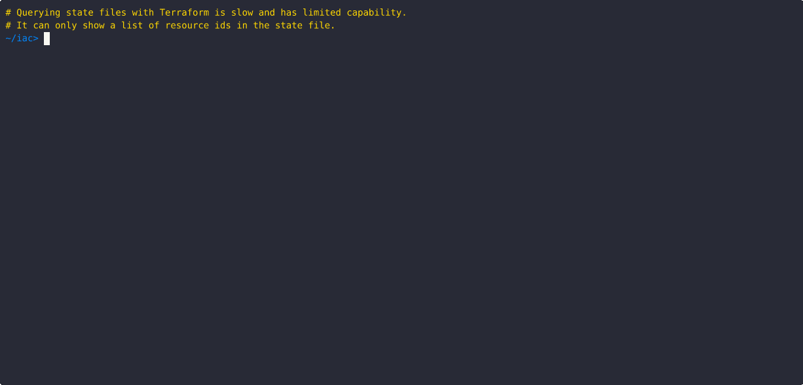

<div align="center">

#

**Supercharge your Terraform workflow with powerful CLI queries**

[](https://golang.org/)
[](https://goreportcard.com/report/github.com/tfquery/tfquery)
[](https://github.com/tfquery/tfquery/releases)
[](https://opensource.org/licenses/Apache-2.0)

</div>

`tfquery` is a command-line tool for querying Terraform and OpenTofu infrastructure. State querying of multiple backend types is a main use-case,. But you can also query the broader Terraform ecosystem - modules, organizations, workspaces, etc - to power reporting and automation.

## Rebrand

`tfquery` was originally released as `tfctl`.

In June 2026, HashiCorp [released](https://www.hashicorp.com/en/blog/introducing-tfctl-the-cli-for-hcp-terraform-and-tfe) its own CLI tool, [`tfctl-cli`](https://github.com/hashicorp/tfctl-cli).

To avoid confusion between the two projects, this project has been rebranded as **`tfquery`**.

The first `tfquery` branded release (`v1.6.0`) contains a minor Windows-specific fix and some lint cleanup, but is otherwise functionally identical to the final `tfctl` release (`v1.5.1`).

While HashiCorp's `tfctl-cli` and `tfquery` have some overlapping capabilities—particularly around querying HCP Terraform and Terraform Enterprise resources—they are designed with different goals in mind.

HashiCorp's `tfctl-cli` focuses on managing HashiCorp platforms and services. `tfquery` focuses on querying, reporting, and exploring Terraform-related resources and metadata. Users may find value in using both tools together, depending on their workflow.

## Key Features

**Multiple Backend Support** - Works with HCP Terraform, Terraform Enterprise, local state files, S3 backends, and module registries.

**Aggregated State Files** - Query resources across multiple state files and aggregate into one result set. Supports mixed backend types.

**Fast Performance** - Built-in Go with concurrent operations and intelligent caching.

**Flexible Output** - Filter, sort, and transform results as JSON, YAML, or formatted tables. Use that output to drive automation workflows. jq-style querying is also available.

**Secure** - Supports OpenTofu encrypted state files and multiple authentication methods.

**Comprehensive** - Query any attribute available through the Terraform APIs.

### Demos

<a href="docs/asciinema/sq.gif" target="_blank" rel="noopener noreferrer">

</a>

<a href="docs/asciinema/common.gif" target="_blank" rel="noopener noreferrer">Common command options</a>

<a href="docs/asciinema/svq.gif" target="_blank" rel="noopener noreferrer">State Version Query (svq)</a>

<a href="docs/asciinema/wq.gif" target="_blank" rel="noopener noreferrer">Workspace Query (svq)</a>

<a href="docs/asciinema/filters.gif" target="_blank" rel="noopener noreferrer">Filter Language</a>

<a href="docs/asciinema/queries.gif" target="_blank" rel="noopener noreferrer">jq Queries</a>

## Why tfquery?

The native Terraform CLI provides essential IAC tooling for managing the lifecycle of resources it creates. But it lacks powerful state querying tools and offers no easily accessible way to query other elements of the Terraform ecosystem like workspaces, organizations, or module registries. This is especially problematic for automation use cases, when you need programmatic access to infrastructure metadata, state history, or cross-workspace insights.

**tfquery fills these gaps** by providing a unified, high-performance CLI for deep querying and analysis of the Terraform ecosystem, enabling better automation, reporting, and operational workflows.

## Installation

### Pre-built binaries

Download the latest release for your platform from the [releases page](https://github.com/tfquery/tfquery/releases).

Extract and move the binary to your PATH:

```bash
tar xvzf tfquery_*.tar.gz
sudo mv tfquery /usr/local/bin
```

### Go package install

```bash
go install github.com/tfquery/tfquery@latest
```

### Homebrew

```bash
brew tap tfquery/tfquery
brew install tfquery
```

**See the full [Installation Guide](docs/installation.md) for other options, plus installing man and TLDR pages.**

## Common Examples

```bash
# Find all workspaces containing "prod" across your organization
tfquery wq --filter 'name@prod'

# Compare state versions to see what changed
tfquery sq --diff

# Summarize changes from a Terraform plan, only showing those resources that
# would be created.
terraform plan | tfquery ps --filter 'action=created'

# List modules by popularity across registries
tfquery mq --sort -downloads

# Export workspace data for automation
tfquery wq --attrs created-at,updated-at --output json

# Aliases are available and functionally identical.
tfquery mq --color
tfquery module --color
```

## Available Commands

| Command | Alias | Purpose | Example |
|---------| ----- | ------- |---------|
| **`mq`** | `module` | Module query | `tfquery mq --filter 'name@aws'` |
| **`oq`** | `org` | Organization query | `tfquery oq --attrs email` |
| **`pq`** | `project` | Project query | `tfquery pq --sort created-at` |
| **`ps`** | `summarize` | Plan summary | `terraform plan \| tfquery ps` |
| **`rq`** | `run` | Run query | `tfquery rq --attrs status` |
| **`sq`** | `state` | State query | `tfquery sq --attrs arn --sort arn` |
| **`svq`** | `state-version` | State version query | `tfquery svq --limit 10` |
| **`wq`** | `workspace` | Workspace query | `tfquery wq --filter 'status@applied'` |

## Documentation

- **[Quick Start Tutorial](docs/quickstart.md)** - Detailed walkthrough with examples
- **[Command Reference](docs/flags.md)** - Complete flag documentation
- **[Attribute Guide](docs/attrs.md)** - Advanced filtering techniques
- **[Filter Expressions](docs/filters.md)** - Filter syntax reference
- **[jq Query Expressions](docs/jq.md)** - Query syntax reference
- **[Configuration](docs/configuration.md)** - Configuration file and environment variables

## Roadmap

**tfquery** is currently read-only and focused on querying. Version 1.x provides stable query functionality for local, TFE/HCP and S3 backends.

**Planned features:**
- Workspace and state manipulation.
- Enhanced S3 backend configuration options.
- Advanced reporting and dashboards.

*Want a feature? [Open an issue](https://github.com/tfquery/tfquery/issues) and help us prioritize!*

## Contributing

Contributions are welcome! Whether it's:
- Bug reports and fixes
- Feature requests and implementations
- Documentation improvements
- Ideas and feedback

**Get started:** Fork the repo, make your changes, and submit a PR. Check out our [issues](https://github.com/tfquery/tfquery/issues) for good first contributions.

## AI Acknowledgment

This project uses AI-assisted tools (mostly GitHub CoPilot) selectively:

- **AI-assisted** — The `si` command experiment (not yet documented), test scaffolding, and most of the documentation were created with AI assistance and reviewed before inclusion.
- **Routine refactoring** — AI tools assisted with lint corrections and minor optimizations.
- **All query command implementations (`oq`, `sq`, `wq`, etc.), and supporting code, were developed without AI assistance.**

## Verify releases

We sign release artifacts with GPG. To verify the integrity and authenticity of downloaded artifacts:

**Download and verify**
```bash
TAG=v1.7.0
ARCHIVE="tfquery_${TAG}_linux_x86_64.tar.gz"

# Download the artifact, detached signature, and public key.
curl -fL "https://github.com/tfquery/tfquery/releases/download/${TAG}/${ARCHIVE}" -o "${ARCHIVE}"
curl -fL "https://github.com/tfquery/tfquery/releases/download/${TAG}/${ARCHIVE}.sig" -o "${ARCHIVE}.sig"
curl -fL "https://raw.githubusercontent.com/tfquery/tfquery/master/KEYS" -o KEYS

# Import the public key (one-time setup)
gpg --import KEYS

# Verify the signature
gpg --verify "${ARCHIVE}.sig" "${ARCHIVE}"
```

**Expected output**
```
gpg: Signature made [date] using RSA key [key-id]
gpg: Good signature from "tfquery <staranto@gmail.com>"
```

If the signature verification fails or shows warnings, do not use the artifact and report the issue.

For complete signing and verification details, including the release key
fingerprint, see [docs/signing.md](docs/signing.md).

---

## License

This project is licensed under the Apache License 2.0. See the [LICENSE](LICENSE) file for details.

*Questions? [Open an issue](https://github.com/tfquery/tfquery/issues)*

## Trademarks

- Terraform, Terraform Enterprise, and HCP Terraform are trademarks or registered trademarks of HashiCorp, Inc.
- OpenTofu is a trademark of The Linux Foundation.

Use of third-party names in this project is for identification and descriptive purposes only and does not imply endorsement, sponsorship, or affiliation.
